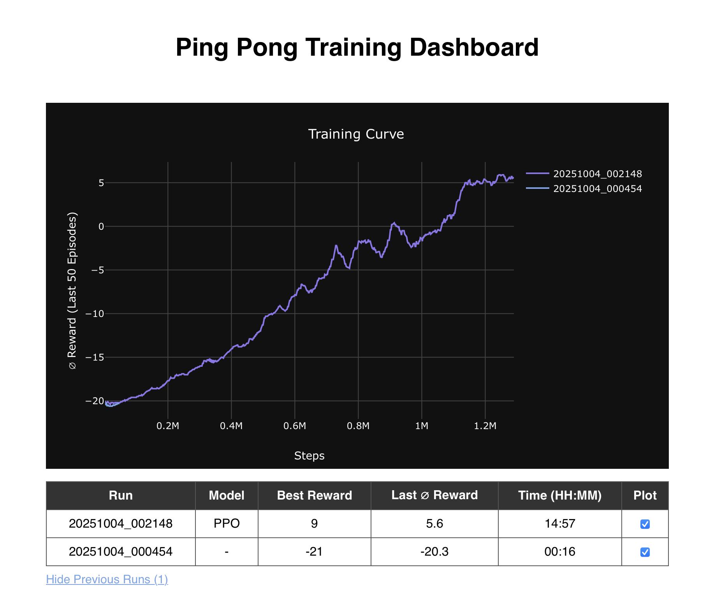
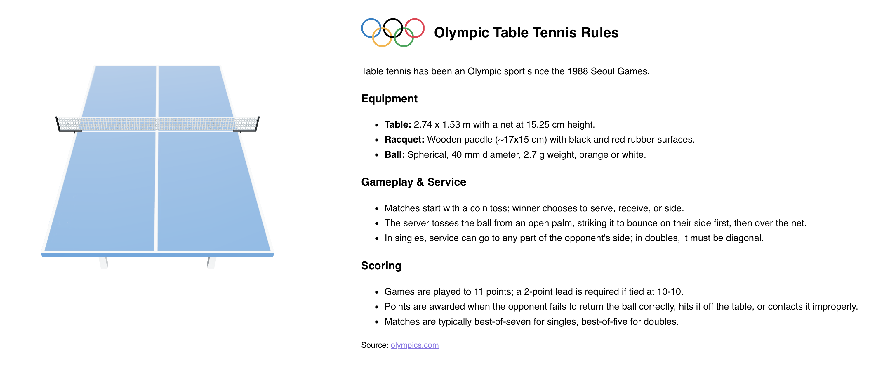

# Ping Pong Dashboard

A real-time dashboard to visualize the training process for a Ping Pong agent, built with&nbsp;
 **FastAPI** (backend) and&nbsp;
 **React** (frontend).


<p align="center">
  
  <br><em>Fig. 1: Ping Pong RL Training Dashboard –<br>Real-time Performance Monitoring.</em>
</p>

## Project Structure

```text
pong-dashboard/
├── backend/
│   ├── main.py                 # FastAPI backend
│   ├── requirements.txt        # FastAPI dependencies
│   └── .env                    # Env variables
├── frontend/
│   ├── public/
│   │   ├── index.html          # React root HTML file
│   │   ├── models/             # 3D models
│   │   └── images/             # Logos, icons, etc.
│   ├── src/
│   │   ├── App.js              # React main component
│   │   ├── App.css             # Styles
│   │   ├── index.js            # React entry point
│   │   ├── index.css           # Global styles
│   │   ├── reportWebVitals.js  # CRA performance metrics
│   │   └── TableTennisScene.js # 3D Table Tennis component
│   ├── package.json            # React dependencies and scripts
│   └── package-lock.json
└── README.md
````

## Features

- **Live training chart**: Plot average rewards of the last 50 episodes over training steps.  
- **KPI cards**: Display best reward, last average reward, and elapsed time.  
- **Run summary table**: Shows previous runs, best reward, last average reward, elapsed time, and model type.  
- **3D Table Tennis model**: Interactive view of a ping pong table using  React Three Fiber     
- **Rules panel**: Briefly explains  Olympic table tennis rules alongside the model.


## Backend Setup

1. Create a virtual environment:

```bash
uv venv --python 3.12
source .venv/bin/activate   # Mac/Linux
.venv\Scripts\activate      # Windows
```

2. Install dependencies:

```bash
uv pip install -r requirements.txt
```

3. Run the FastAPI server:

```bash
uvicorn main:app --reload --host 0.0.0.0 --port 8000
```

The backend exposes:

- http://localhost:8000/results — latest training run data
- http://localhost:8000/runs — summary of all runs

## Frontend Setup

Navigate to the frontend directory:

```bash
cd frontend
```

2. Install dependencies:

```bash
npm install
```


3. Start the development server:

```bash
npm start
```

4. Open http://localhost:3000 to view the dashboard with the training metrics (Fig. 1).

5. For convenience, a summary of the official Olympic Table Tennis Rules can be found beneath the dashboard (Fig. 2).

<p align="center">
  
  <br><em>Fig. 2: Table Tennis 3D Model<br>and Olympic Rules.</em>
</p>


## License

MIT

## Credit

The 3D model of the Table Tennis titled ["Low Poly Table Tennis"](https://sketchfab.com/3d-models/low-poly-table-tennis-5daf236766f74e71a4c4375032a76b70) is the work by [Xorshift](https://sketchfab.com/Xorshift) licensed under [CC-BY-4.0](http://creativecommons.org/licenses/by/4.0/)

